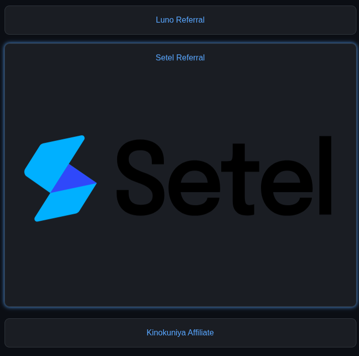

# link-aggregator
`Working on a way to edit the user data with html and js`
`Please use manual edit for the time being`
## Important
- Refer to `src/manifest.json` for list of available icons for socials and general themes.
- Themes will default to `"theme":"midnight"`
- Add your images for profile image and icons into  `src/assets` and update the path in `*.user`.
- Your image will not be kept in this repository
## Export Your Link Aggregator
- Run `export.sh`.
- If you have multiple `*.user` file, please delete unwanted `*.user` manually.
- Copy the contents of `export/` into your directory.
## Example
#### [Hidari Shoya](https://darwishzain.github.io/hidarishoya/index.html?@hidarishoya) ( `"theme":"midnight"` )
##### Profile

##### Links

## To do
- Functions to add new user configuration with placeholder informations.
- Functions to edit existing user configurations and options to choose from items in `src/manifest.json`.
- Functions to export pages for specific user.
